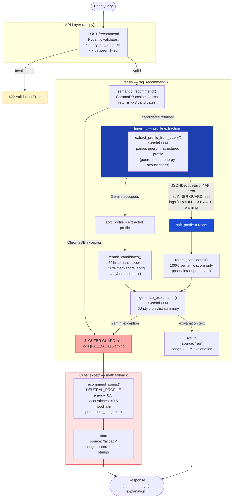

# 🎵 Music Recommender Simulation

## How The System Works

## System Upgrade: From Math to Semantic RAG

This is the extension of the CodePath Music Recommender assignment.

The original recommender was a purely mathematical system which was made from abritary weigths I made. Every song was scored against
a structured UserProfile using five weighted formulas: genre family match, mood equality,energy proximity, acousticness proximity, and valence proximity. The final score was a
weighted sum of 0-to-1 sub-scores, and the top-k songs by score were returned. This is
entirely deterministic — the same inputs always produce the same ranked list, with no
understanding of language or meaning. As such the recommender was largely restricted.


In this upgrade, I have introduced a semantic upgrade built on Retrieval-Augmented Generation (RAG).
Instead of structured UserProfile fields, the system now accepts a free-form natural
language query ("I need something chill to study to"). Then ChromaDB embeds that query and
all 50 songs into a shared vector space using the all-MiniLM-L6-v2 sentence-transformer
model, then it retrieves the closest songs by cosine distance. The retrieved songs are
passed as context to Gemini, which I have imbedded a DJ-style prompt for best results. 
It generates a DJ-style explanation of why each trackfits the request when giving each recommendation. 
If the LLM call fails for any reason, the system falls back to a complete sementic retrieval as the inner Guardrail. However, if the whole pipeline 
fails, then the system falls back to the original score_song math using a neutral mid-range profile, ensuring the API always returns a valid response.

## Architecture



Text description: User Query → FastAPI /recommend → ChromaDB vector search → Gemini LLM → JSON response

---

## Getting Started

### Prerequisites
- Python 3.11+
- A Gemini API key (free tier at https://aistudio.google.com/)

### 1. Install dependencies
```bash
pip install -r requirements.txt
```

### 2. Configure your API key
Create a `.env` file in the project root:
```
GEMINI_API_KEY=your_key_here
```

### 3. Run the original CLI recommender (math-based)
```bash
python -m src.main
```

### 4. Run the RAG demo (semantic + LLM explanations)
```bash
python src/main.py
```
This calls `run_semantic_demo()` which executes 3 sample queries and prints results.

### 5. Start the FastAPI server
Run from the **project root** (not from `src/`) so `data/songs.csv` resolves correctly:
```bash
uvicorn api:app --app-dir src --reload
```
Expected startup output:
```
INFO:     [STARTUP] Loaded 50 songs into ChromaDB.
INFO:     Uvicorn running on http://127.0.0.1:8000
```

### 6. Test the API

Health check:
```bash
curl http://localhost:8000/
```
Expected: `{"status":"ok","songs_loaded":50}`

Sample recommendation request:
```bash
curl -s -X POST http://localhost:8000/recommend \
  -H "Content-Type: application/json" \
  -d '{"query": "I need focus music for studying", "k": 5}' | python3 -m json.tool
```

Sample response (trimmed):
```json
{
  "source": "rag",
  "songs": [
    {
      "id": 3,
      "title": "Library Rain",
      "artist": "Paper Lanterns",
      "genre": "lofi",
      "mood": "chill",
      "energy": 0.35,
      "tempo_bpm": 72.0,
      "valence": 0.6,
      "danceability": 0.4,
      "acousticness": 0.86
    }
  ],
  "explanation": "Library Rain by Paper Lanterns is perfect for a study session..."
}
```

Interactive API docs (Swagger UI): http://localhost:8000/docs

### Running Tests

There are three test files, each serving a different purpose:

**Full test suite** — scoring correctness, edge cases, and semantic retrieval:
```bash
pytest
```

**Guardrail behaviour tests** — asserts that each fallback path fires and recovers correctly:
```bash
pytest tests/test_guardrails.py -v
```

**Living walkthrough** — prints a labelled example of every system path (full RAG, inner guard, outer guard) including any guardrail warnings as proof they fired:
```bash
pytest -s tests/test_examples.py
```

Example output from the walkthrough:
```
PATH 1 — Full RAG  (ChromaDB + Gemini profile + Gemini explanation)
  guardrail warnings : none
  #1  Drift & Dissolve — Pale Signal  genre=ambient  mood=peaceful  energy=0.18
  source=rag  ← full RAG pipeline completed

PATH 2 — Inner Guard  (profile extraction throws → semantic-only ranking)
  guardrail warnings fired:
    ⚠  [PROFILE EXTRACT] Failed (ConnectionError). Ranking by semantic score only.
  #1  Cathedral Echo — Mira Voss  genre=classical  mood=peaceful  energy=0.22
  source=rag  ← pipeline recovered; ChromaDB semantic scores drove ranking

PATH 3 — Outer Guard  (ChromaDB down → pure math fallback)
  guardrail warnings fired:
    ⚠  [FALLBACK] RAG pipeline failed (RuntimeError: ChromaDB connection lost). Falling back to score_song math.
  #1  Midnight Coding — LoRoom  genre=lofi  mood=chill  energy=0.42
  source=fallback  ← query-unaware; NEUTRAL_PROFILE math returned regardless of query
```

---

## Limitations and Risks

There are two main limitations to this project: catalog size and LLM capacity. As any recommender system, the more songs in the catalogue the more accurate the system will be. This issue is especially highlighted in this project because my data is in the form of a csv file instead of api calls from a music API. This will be a future implementation to add. The second limitation is the harder limition. As this project is a LLM recommender at its core, AI API keys dominate the survivability of the project. Should the API key be exhausted, the project would not be nearly as efficient. As such, this project can run at its max potential around 20-30 times before performance drops.
---

## Reflection

[**Model Card**](model_card.md)

Building this recommender showed how quickly structured scoring becomes a blunt instrument. The math pipeline converts rich musical preferences into five numbers and then adds them up — which works surprisingly well when a user's profile is coherent, but collapses when preferences contradict each other or when a requested mood simply doesn't exist in the catalog. The system can't ask a clarifying question; it just picks the best available compromise, which means the signal with the most weight always wins, regardless of what the user actually cared about most.

The RAG upgrade revealed a different kind of bias: the embedding model treats the natural language description of a song as a proxy for the song itself. Songs described with more specific or vivid language get retrieved more reliably than songs with generic labels. That's a data quality problem masquerading as a retrieval problem — if a song is labeled "chill" but the catalog entry doesn't mention studying or background listening, it may be outranked by a song that happens to use those exact words.

I do not believe this AI system can be misused as there are no security concerns regarding the project. However, exception handing may cause issues in terms of misusing and as such to prevent that, I have implemented two types of guardrails as seen above.

## AI-Assisted Development Reflection

I used Claude extensively throughout the entire to accelerate
implementation. But its biggest benefit was assisting me in design of the system, as represented in plan.txt. 
However there were some issues I had to redirect the AI or manually overide, which I'll state shortly.

**One prompt that worked extremely well:**
When I asked Claude to design the fallback guardrail in `rag_recommend()`, I described
the constraint: "the fallback must use the existing score_song math, but score_song
needs a structured UserProfile dict — not a free-text query." Claude immediately
identified that a `NEUTRAL_PROFILE` constant with mid-range float values was the right
bridge, and generated the try/except wrapper with consistent return keys ("source",
"songs", "explanation") so the FastAPI response schema would never change regardless of
which path ran. That architectural insight would have taken me longer to see on my own.

**One suggestion I had to fix manually:**
Claude initially suggested using `google.generativeai` (the old `genai` SDK) with
`genai.GenerativeModel("gemini-1.5-flash")` and `model.generate_content(prompt)`. This
syntax is from an older version of the library. The current package (`google-genai`)
uses a client-based API: `genai.Client(api_key=...)` and
`client.models.generate_content(model=..., contents=...)`. I had to read the current
SDK docs to spot the mismatch and update the call signature in `generate_explanation()`.
The code Claude gave me would have thrown an AttributeError at runtime.

**What I learned:**
AI coding assistants are strongest at high-level design (identifying the right
abstraction, structuring a consistent return schema) and weakest when SDK APIs have
changed since their training cutoff. Treat generated import paths and method signatures
as "probably right" rather than "definitely right" — always verify against the current
library docs before committing. Another major issue is that AI cannot see everything 
the developer sees, and as such it can hallucinate. As such it is very important to 
learn focus prompting to have the AI implement solutions in managable chunks rather
than one big push which may introduce multiple bugs. 

**Journey onto an AI Engineer:**
As I have learned to work alongside AI to now build AI projects, I have understood
the most important part is that the developer has the final say. Throughout the whole process
of building this project I made sure to prompt the AI to explain each of its choices whenever I did not know 
exactly the process, and this routine has drastically improved my comprehension of 
the project and lets me the developer take the final lead. I also understand the power of AI and how it has 
increased productivity as a whole, knowing how to prompt the AI is key to success. I strive to be an AI
engineer with utility of AI building on top of my own creativity and critical thinking skills. 
---
