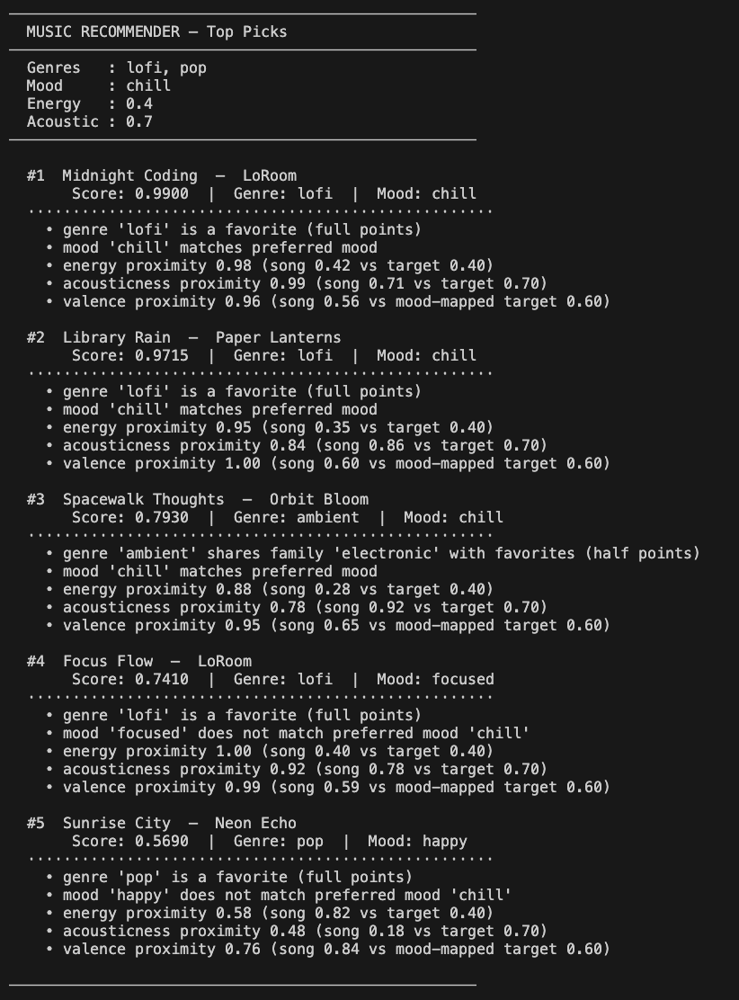
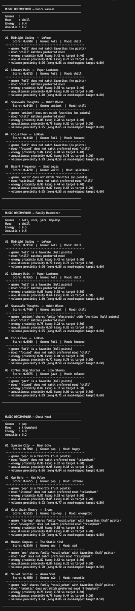
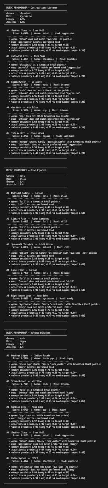

# 🎵 Music Recommender Simulation

## Project Summary

In this project you will build and explain a small music recommender system.

Your goal is to:

- Represent songs and a user "taste profile" as data
- Design a scoring rule that turns that data into recommendations
- Evaluate what your system gets right and wrong
- Reflect on how this mirrors real world AI recommenders

Replace this paragraph with your own summary of what your version does.

The user gives a csv file of songs with set field requirements. I take that into my system and have a scoring logic built with genre, mood, energy, valence, and accousticness with respective weigths and send these results to the ranking logic. The ranking logic sorts the results based on score and sends the top k results. If a tie between score happens, we go catalouge based for ranking based on stable sorting.
---

## How The System Works

Explain your design in plain language.

Some prompts to answer:

- What features does each `Song` use in your system
  - For example: genre, mood, energy, tempo
- What information does your `UserProfile` store
- How does your `Recommender` compute a score for each song
- How do you choose which songs to recommend

You can include a simple diagram or bullet list if helpful.

The key to formulating a plan is to understand collaborative filtering and context-based filtering works. After researching, I understood that collaborative filtering goes off the user's preferences and instead of comparing the songs themselves, it compares with users who have similar interests and gives songs from there. On the other had contest-based filtering goes off the techinical aspects of the song they listen to and filters based on that. 

So for my logic on scoring and ranking, I have split them.

Scoring Rules: (Each Rule will be scored from 0.0 to 1.0 then multiplied by weigth)
- Genre Match: The closer a song is to the user's gavorite genres, give more points up to 0.30
  - If song is in user's fav genres, get full pts
  - If song shares a family with user's fav genres, get half pts
  - Otherwise 0 pts
- Mood Match: A song is the right mood the user's wants, so can only be ranked 0.0 or 1.0 by weigth, give points up to 0.25
- Energy Proximity: The closer the song's energy is to the user's target energy, the higher the score till 0.25
- Acoustic Preference: If user likes higher acoustic music, find higher points for higher acousticness, if they like more electronic, find higher points for lower acousticness, up to 0.10
- Valence Proximity: We take the user's mood from the table(happy,relaxed,chill,etc) and then score based on how closely the audio property matches the users mood, up to 0.10

Ranking Rules:
- Sort descending by score
- Return Top k results
- Tie-Breaking by Catalog Order: When there is an exact score, go by catalog order, therefore we need to implement a stable sort

The logic is that once we get a song scored and ready to be sent for ranking, we reccomend based on the highest score, which would most likely mesh with user's interests/mood to listen to right now.

For Song object, we will be using title, artist, genre, mood, energy, acousticness, and valence. For User profile object, we will be using favorite_genre, favorite_mood, target_energy, and target_acousticness.

I changed likes_acoustic to target acousticness to match my logic for accoustic scoring in float based over boolean based. Favorite_genre is also a list now so that user can define multiple genres. I also have a genre family, to adjust toward rule S1 to be not binary but rather float based.

NOTE: System might overprioritize genre and mood over the others

flowchart TD
    A([Start]) --> B[User provides UserProfile\nfavorite_genre list\nfavorite_mood\ntarget_energy\ntarget_acousticness]
    B --> C[Load song catalog\nfrom songs.csv\n20 Songs with genre mood\nenergy acousticness valence]

    C --> D{For each Song\nin catalog}

    D --> E[S1 · Genre Match\nweight 0.30\nFav genre → 1.0\nSame family → 0.5\nNo match → 0.0]
    D --> F[S2 · Mood Match\nweight 0.25\nMood equals fav_mood\n→ 1.0 else 0.0]
    D --> G[S3 · Energy Proximity\nweight 0.25\n1 minus abs difference\nof song vs target]
    D --> H[S4 · Acoustic Preference\nweight 0.10\n1 minus abs difference\nof song vs target]
    D --> I[S5 · Valence Proximity\nweight 0.10\nMap mood to valence range\nscore closeness]

    E --> J[Weighted Sum\nfinal score 0.0 to 1.0]
    F --> J
    G --> J
    H --> J
    I --> J

    J --> K[Attach score to Song]
    K --> D

    D -->|All songs scored| L[Sort descending by score\nStable sort — catalog order\nas tie-breaker]

    L --> M[Slice top k results]
    M --> N([Return Top-K Recommended Songs])

---

## Getting Started

### Setup

1. Create a virtual environment (optional but recommended):

   ```bash
   python -m venv .venv
   source .venv/bin/activate      # Mac or Linux
   .venv\Scripts\activate         # Windows

2. Install dependencies

```bash
pip install -r requirements.txt
```

3. Run the app:

```bash
python -m src.main
```

### Running Tests

Run the starter tests with:

```bash
pytest
```

You can add more tests in `tests/test_recommender.py`.

---

## Experiments You Tried

Use this section to document the experiments you ran. For example:

- What happened when you changed the weight on genre from 2.0 to 0.5
- What happened when you added tempo or valence to the score
- How did your system behave for different types of users

I realized when I doubled energy and halved weigth for genre, the scoring became very flawed as the results could contain genres that were the opposite of what I wanted. When I added valence to the score, since my system has the valence hard-coded and valence itself did not have much weigth to it, the system choices actually improved a little because valence was picking up the slack of the "binary-coded" mood field. Users that had moods more present in csv file had a clearer reccomender system that users that didnt
---

## Limitations and Risks

Summarize some limitations of your recommender.

Examples:

- It only works on a tiny catalog
- It does not understand lyrics or language
- It might over favor one genre or mood

You will go deeper on this in your model card.

Catalog size defintely made reccomending songs harder. But having one of my scoring set on binary only 0.0 or 1.0 made the job even harder, how those that matched the mood significantly gains more than those dont, even if the user wanted "chill", "relaxed" is close but the reccomender would not notice that.
---

## Reflection

Read and complete `model_card.md`:

[**Model Card**](model_card.md)

Write 1 to 2 paragraphs here about what you learned:

- about how recommenders turn data into predictions
- about where bias or unfairness could show up in systems like this


---

## 7. `model_card_template.md` 

ALL REFLECTION COMPLETED IN model_card.md

Combines reflection and model card framing from the Module 3 guidance. :contentReference[oaicite:2]{index=2}  

```markdown
# 🎧 Model Card - Music Recommender Simulation

## 1. Model Name

Give your recommender a name, for example:

> 

---

## 2. Intended Use

- What is this system trying to do
- Who is it for

Example:


---

## 3. How It Works (Short Explanation)

Describe your scoring logic in plain language.

- What features of each song does it consider
- What information about the user does it use
- How does it turn those into a number

Try to avoid code in this section, treat it like an explanation to a non programmer.

---

## 4. Data

Describe your dataset.

- How many songs are in `data/songs.csv`
- Did you add or remove any songs
- What kinds of genres or moods are represented
- Whose taste does this data mostly reflect

---

## 5. Strengths

Where does your recommender work well

You can think about:
- Situations where the top results "felt right"
- Particular user profiles it served well
- Simplicity or transparency benefits

---

## 6. Limitations and Bias

Where does your recommender struggle

Some prompts:
- Does it ignore some genres or moods
- Does it treat all users as if they have the same taste shape
- Is it biased toward high energy or one genre by default
- How could this be unfair if used in a real product

---

## 7. Evaluation

How did you check your system

Examples:
- You tried multiple user profiles and wrote down whether the results matched your expectations
- You compared your simulation to what a real app like Spotify or YouTube tends to recommend
- You wrote tests for your scoring logic

You do not need a numeric metric, but if you used one, explain what it measures.

---

## 8. Future Work

If you had more time, how would you improve this recommender

Examples:

- Add support for multiple users and "group vibe" recommendations
- Balance diversity of songs instead of always picking the closest match
- Use more features, like tempo ranges or lyric themes

---

## 9. Personal Reflection

A few sentences about what you learned:

- What surprised you about how your system behaved
- How did building this change how you think about real music recommenders
- Where do you think human judgment still matters, even if the model seems "smart"






---

## Contradictory Profile Comparisons

These comments explain what happens when you run pairs of profiles from `CONTRADICTORY_USER_PROFILES` and compare their outputs side by side.

---

### Pair 1: Genre Vacuum vs Family Maximizer

**Genre Vacuum** lists zero favorite genres. Because no genre can ever match an empty list, every single song in the catalog scores zero on the genre signal — that whole 25% weight goes unused. The recommender has no choice but to rank songs purely on mood (chill), energy (0.4), and acousticness (0.7). Soft, slow, acoustic songs like *Library Rain* and *Midnight Coding* float to the top not because they fit a genre the user likes, but simply because they feel calm and quiet. Genre becomes a dead dial — turned all the way off.

**Family Maximizer** goes to the opposite extreme: four genres (lofi, rock, jazz, hip-hop) that happen to touch almost every genre family in the catalog. Nearly every song earns at least quarter-points for genre because the user's taste covers so much ground. The genre signal is now so widely shared that it barely separates songs from each other — it becomes noise rather than signal. Paradoxically, the output ends up being driven by the same mood and energy proximity as Genre Vacuum, just for the opposite reason: not because genre scoring is blocked, but because it is nearly maxed out everywhere.

> **Why this matters:** If a user tells the system nothing (or everything) about their genre taste, genre stops mattering. The recommendations look similar from both extremes, which reveals that genre is most useful when it is specific and narrow.

---

### Pair 2: Ghost Mood vs Contradictory Listener

**Ghost Mood** asks for a "triumphant" mood — a mood that simply does not exist in the song catalog. Since no song can match a label that was never used, the mood signal scores zero for every track. The system falls back on genre (pop) and energy (0.8). High-energy pop songs like *Sunrise City* and *Gym Hero* rise to the top even though the user presumably wanted something that felt triumphant and uplifting. The recommender cannot invent what is not there, so it ignores the broken signal entirely and optimizes around the remaining ones.

**Contradictory Listener** wants classical music, an aggressive mood, and extreme high energy (0.95). The only classical song in the catalog, *Cathedral Echo*, is peaceful, nearly silent (energy 0.22), and highly acoustic (0.96) — the exact opposite of aggressive and high-energy. No single song can satisfy all three signals simultaneously. In practice the energy and mood weights (combined 50%) overpower the genre weight (25%), so the system recommends metal and electronic songs like *Shatter Glass* that are aggressive and high-energy. The user asked for classical and got metal instead — because the numbers forced the trade-off.

> **Why this matters:** When a user's preferences contradict each other, the system does not warn you or ask for clarification — it just picks the best available compromise. The winner is whatever signal has the most weight, not necessarily the signal the user cared about most.

---

### Pair 3: Mood Adjacent vs Valence Hijacker

**Mood Adjacent** is a coherent, internally consistent profile: lofi genre, chill mood, low energy (0.4), high acousticness (0.8). Every preference points in the same direction. Songs like *Library Rain* satisfy all five scoring signals almost simultaneously — right genre, right mood, right energy, right acousticness, right emotional tone (valence). The top-5 results feel obviously correct: soft, slow, acoustic lofi tracks dominate because the profile gives the system a clear and unified target.

**Valence Hijacker** mixes a high-energy rock preference with a "happy" mood. The problem is that rock songs in the catalog (*Storm Runner*) are tagged as "intense," not "happy." And the genuinely happy songs (*Sunrise City*, *Rooftop Lights*) are pop, not rock. Genre and mood pull in opposite directions. A song that earns full genre points misses on mood; a song that earns full mood points misses on genre. The system ends up recommending tracks that split the difference — decent energy proximity, partial genre credit — but nothing fully satisfies the user. This is a real pattern in music apps: people who like a genre for its sound but want a different emotional vibe than that genre typically delivers get messy results.

> **Why this matters:** The cleaner and more consistent a user's preferences are, the better the recommendations. When genre and mood contradict each other, the system hedges — and the output can feel off to the user even though the math is working exactly as designed.

---

### Note: Perfect Ringer (tuned to Library Rain)

This profile is reverse-engineered to match *Library Rain* almost exactly: lofi genre, chill mood, energy 0.35, acousticness 0.86. All five scoring signals align for that one song at the same time. *Library Rain* scores at or near the maximum because it earns full points on genre match, full points on mood match, near-perfect energy proximity, near-perfect acousticness proximity, and the valence of 0.60 lines up well with the chill mood target. It floats to #1 easily.

This profile is a sanity check: it confirms the scoring system is working correctly. When a user's stated preferences genuinely and precisely describe a song in the catalog, that song should win — and it does. If it did not, something would be broken in the logic.