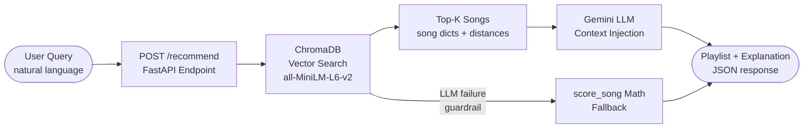
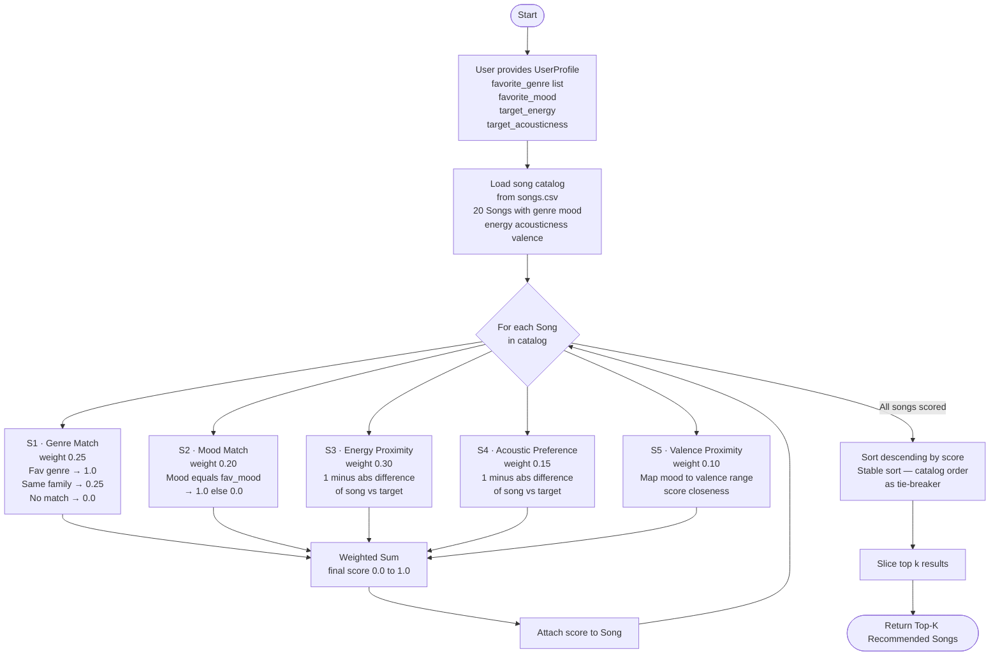

# 🎵 Music Recommender Simulation

## Project Summary

The user gives a csv file of songs with set field requirements. I take that into my system and have a scoring logic built with genre, mood, energy, valence, and accousticness with respective weigths and send these results to the ranking logic. The ranking logic sorts the results based on score and sends the top k results. If a tie between score happens, we go catalouge based for ranking based on stable sorting.
---

## How The System Works

## System Upgrade: From Math to Semantic RAG

The original recommender was a purely mathematical system. Every song was scored against
a structured UserProfile using five weighted formulas: genre family match, mood equality,
energy proximity, acousticness proximity, and valence proximity. The final score was a
weighted sum of 0-to-1 sub-scores, and the top-k songs by score were returned. This is
entirely deterministic — the same inputs always produce the same ranked list, with no
understanding of language or meaning.

Hours 1–3 introduce a semantic upgrade built on Retrieval-Augmented Generation (RAG).
Instead of structured UserProfile fields, the system now accepts a free-form natural
language query ("I need something chill to study to"). ChromaDB embeds that query and
all 20 songs into a shared vector space using the all-MiniLM-L6-v2 sentence-transformer
model, then retrieves the closest songs by cosine distance. The retrieved songs are
passed as context to Gemini, which generates a DJ-style explanation of why each track
fits the request. If the LLM call fails for any reason, the system falls back to the
original score_song math using a neutral mid-range profile, ensuring the API always
returns a valid response.

## Architecture



Text description: User Query → FastAPI /recommend → ChromaDB vector search → Gemini LLM → JSON response

---

The key to formulating a plan is to understand collaborative filtering and context-based filtering works. After researching, I understood that collaborative filtering goes off the user's preferences and instead of comparing the songs themselves, it compares with users who have similar interests and gives songs from there. On the other had contest-based filtering goes off the techinical aspects of the song they listen to and filters based on that. 

So for my logic on scoring and ranking, I have split them.

Scoring Rules: (Each Rule will be scored from 0.0 to 1.0 then multiplied by weigth)
- Genre Match: The closer a song is to the user's gavorite genres, give more points up to 0.30
  - If song is in user's fav genres, get full pts
  - If song shares a family with user's fav genres, get half pts
  - Otherwise 0 pts
- Mood Match: A song is the right mood the user's wants, so can only be ranked 0.0 or 1.0 by weigth, give points up to 0.25
- Energy Proximity: The closer the song's energy is to the user's target energy, the higher the score till 0.25
- Acoustic Preference: If user likes higher acoustic music, find higher points for higher acousticness, if they like more electronic, find higher points for lower acousticness, up to 0.10
- Valence Proximity: We take the user's mood from the table(happy,relaxed,chill,etc) and then score based on how closely the audio property matches the users mood, up to 0.10

Ranking Rules:
- Sort descending by score
- Return Top k results
- Tie-Breaking by Catalog Order: When there is an exact score, go by catalog order, therefore we need to implement a stable sort

The logic is that once we get a song scored and ready to be sent for ranking, we reccomend based on the highest score, which would most likely mesh with user's interests/mood to listen to right now.

For Song object, we will be using title, artist, genre, mood, energy, acousticness, and valence. For User profile object, we will be using favorite_genre, favorite_mood, target_energy, and target_acousticness.

I changed likes_acoustic to target acousticness to match my logic for accoustic scoring in float based over boolean based. Favorite_genre is also a list now so that user can define multiple genres. I also have a genre family, to adjust toward rule S1 to be not binary but rather float based.

NOTE: System might overprioritize genre and mood over the others



---

## Getting Started

### Prerequisites
- Python 3.11+
- A Gemini API key (free tier at https://aistudio.google.com/)

### 1. Install dependencies
```bash
pip install -r requirements.txt
```

### 2. Configure your API key
Create a `.env` file in the project root:
```
GEMINI_API_KEY=your_key_here
```

### 3. Run the original CLI recommender (math-based)
```bash
python -m src.main
```

### 4. Run the RAG demo (semantic + LLM explanations)
```bash
python src/main.py
```
This calls `run_semantic_demo()` which executes 3 sample queries and prints results.

### 5. Start the FastAPI server
Run from the **project root** (not from `src/`) so `data/songs.csv` resolves correctly:
```bash
uvicorn api:app --app-dir src --reload
```
Expected startup output:
```
INFO:     [STARTUP] Loaded 20 songs into ChromaDB.
INFO:     Uvicorn running on http://127.0.0.1:8000
```

### 6. Test the API

Health check:
```bash
curl http://localhost:8000/
```
Expected: `{"status":"ok","songs_loaded":20}`

Sample recommendation request:
```bash
curl -s -X POST http://localhost:8000/recommend \
  -H "Content-Type: application/json" \
  -d '{"query": "I need focus music for studying", "k": 5}' | python3 -m json.tool
```

Sample response (trimmed):
```json
{
  "source": "rag",
  "songs": [
    {
      "id": 3,
      "title": "Library Rain",
      "artist": "Cozy Vibes",
      "genre": "lofi",
      "mood": "chill",
      "energy": 0.35,
      "tempo_bpm": 72.0,
      "valence": 0.6,
      "danceability": 0.4,
      "acousticness": 0.86
    }
  ],
  "explanation": "Library Rain by Cozy Vibes is perfect for a study session..."
}
```

Interactive API docs (Swagger UI): http://localhost:8000/docs

### Running Tests

```bash
pytest
```

---

## Experiments You Tried

I realized when I doubled energy and halved weight for genre, the scoring became very flawed as the results could contain genres that were the opposite of what I wanted. When I added valence to the score, since my system has the valence hard-coded and valence itself did not have much weight to it, the system choices actually improved a little because valence was picking up the slack of the "binary-coded" mood field. Users that had moods more present in the csv file had a clearer recommender system than users that didn't.
---

## Limitations and Risks

Catalog size definitely made recommending songs harder. But having one of my scoring signals set to binary-only 0.0 or 1.0 made the job even harder — songs that matched the mood gain significantly more than those that don't, even if the user wanted "chill" and "relaxed" is close. The recommender would not notice that similarity at all.
---

## Reflection

[**Model Card**](model_card.md)

Building this recommender showed how quickly structured scoring becomes a blunt instrument. The math pipeline converts rich musical preferences into five numbers and then adds them up — which works surprisingly well when a user's profile is coherent, but collapses when preferences contradict each other or when a requested mood simply doesn't exist in the catalog. The system can't ask a clarifying question; it just picks the best available compromise, which means the signal with the most weight always wins, regardless of what the user actually cared about most.

The RAG upgrade revealed a different kind of bias: the embedding model treats the natural language description of a song as a proxy for the song itself. Songs described with more specific or vivid language get retrieved more reliably than songs with generic labels. That's a data quality problem masquerading as a retrieval problem — if a song is labeled "chill" but the catalog entry doesn't mention studying or background listening, it may be outranked by a song that happens to use those exact words.

## AI-Assisted Development Reflection

I used Claude (claude-sonnet-4-6) extensively throughout Hours 1–3 to accelerate
implementation. Here is an honest account of where it helped and where it led me astray.

**One prompt that worked extremely well:**
When I asked Claude to design the fallback guardrail in `rag_recommend()`, I described
the constraint: "the fallback must use the existing score_song math, but score_song
needs a structured UserProfile dict — not a free-text query." Claude immediately
identified that a `NEUTRAL_PROFILE` constant with mid-range float values was the right
bridge, and generated the try/except wrapper with consistent return keys ("source",
"songs", "explanation") so the FastAPI response schema would never change regardless of
which path ran. That architectural insight would have taken me longer to see on my own.

**One suggestion I had to fix manually:**
Claude initially suggested using `google.generativeai` (the old `genai` SDK) with
`genai.GenerativeModel("gemini-1.5-flash")` and `model.generate_content(prompt)`. This
syntax is from an older version of the library. The current package (`google-genai`)
uses a client-based API: `genai.Client(api_key=...)` and
`client.models.generate_content(model=..., contents=...)`. I had to read the current
SDK docs to spot the mismatch and update the call signature in `generate_explanation()`.
The code Claude gave me would have thrown an AttributeError at runtime.

**What I learned:**
AI coding assistants are strongest at high-level design (identifying the right
abstraction, structuring a consistent return schema) and weakest when SDK APIs have
changed since their training cutoff. Treat generated import paths and method signatures
as "probably right" rather than "definitely right" — always verify against the current
library docs before committing.

---

## Contradictory Profile Comparisons

These comments explain what happens when you run pairs of profiles from `CONTRADICTORY_USER_PROFILES` and compare their outputs side by side.

---

### Pair 1: Genre Vacuum vs Family Maximizer

**Genre Vacuum** lists zero favorite genres. Because no genre can ever match an empty list, every single song in the catalog scores zero on the genre signal — that whole 25% weight goes unused. The recommender has no choice but to rank songs purely on mood (chill), energy (0.4), and acousticness (0.7). Soft, slow, acoustic songs like *Library Rain* and *Midnight Coding* float to the top not because they fit a genre the user likes, but simply because they feel calm and quiet. Genre becomes a dead dial — turned all the way off.

**Family Maximizer** goes to the opposite extreme: four genres (lofi, rock, jazz, hip-hop) that happen to touch almost every genre family in the catalog. Nearly every song earns at least quarter-points for genre because the user's taste covers so much ground. The genre signal is now so widely shared that it barely separates songs from each other — it becomes noise rather than signal. Paradoxically, the output ends up being driven by the same mood and energy proximity as Genre Vacuum, just for the opposite reason: not because genre scoring is blocked, but because it is nearly maxed out everywhere.

> **Why this matters:** If a user tells the system nothing (or everything) about their genre taste, genre stops mattering. The recommendations look similar from both extremes, which reveals that genre is most useful when it is specific and narrow.

---

### Pair 2: Ghost Mood vs Contradictory Listener

**Ghost Mood** asks for a "triumphant" mood — a mood that simply does not exist in the song catalog. Since no song can match a label that was never used, the mood signal scores zero for every track. The system falls back on genre (pop) and energy (0.8). High-energy pop songs like *Sunrise City* and *Gym Hero* rise to the top even though the user presumably wanted something that felt triumphant and uplifting. The recommender cannot invent what is not there, so it ignores the broken signal entirely and optimizes around the remaining ones.

**Contradictory Listener** wants classical music, an aggressive mood, and extreme high energy (0.95). The only classical song in the catalog, *Cathedral Echo*, is peaceful, nearly silent (energy 0.22), and highly acoustic (0.96) — the exact opposite of aggressive and high-energy. No single song can satisfy all three signals simultaneously. In practice the energy and mood weights (combined 50%) overpower the genre weight (25%), so the system recommends metal and electronic songs like *Shatter Glass* that are aggressive and high-energy. The user asked for classical and got metal instead — because the numbers forced the trade-off.

> **Why this matters:** When a user's preferences contradict each other, the system does not warn you or ask for clarification — it just picks the best available compromise. The winner is whatever signal has the most weight, not necessarily the signal the user cared about most.

---

### Pair 3: Mood Adjacent vs Valence Hijacker

**Mood Adjacent** is a coherent, internally consistent profile: lofi genre, chill mood, low energy (0.4), high acousticness (0.8). Every preference points in the same direction. Songs like *Library Rain* satisfy all five scoring signals almost simultaneously — right genre, right mood, right energy, right acousticness, right emotional tone (valence). The top-5 results feel obviously correct: soft, slow, acoustic lofi tracks dominate because the profile gives the system a clear and unified target.

**Valence Hijacker** mixes a high-energy rock preference with a "happy" mood. The problem is that rock songs in the catalog (*Storm Runner*) are tagged as "intense," not "happy." And the genuinely happy songs (*Sunrise City*, *Rooftop Lights*) are pop, not rock. Genre and mood pull in opposite directions. A song that earns full genre points misses on mood; a song that earns full mood points misses on genre. The system ends up recommending tracks that split the difference — decent energy proximity, partial genre credit — but nothing fully satisfies the user. This is a real pattern in music apps: people who like a genre for its sound but want a different emotional vibe than that genre typically delivers get messy results.

> **Why this matters:** The cleaner and more consistent a user's preferences are, the better the recommendations. When genre and mood contradict each other, the system hedges — and the output can feel off to the user even though the math is working exactly as designed.

---

### Note: Perfect Ringer (tuned to Library Rain)

This profile is reverse-engineered to match *Library Rain* almost exactly: lofi genre, chill mood, energy 0.35, acousticness 0.86. All five scoring signals align for that one song at the same time. *Library Rain* scores at or near the maximum because it earns full points on genre match, full points on mood match, near-perfect energy proximity, near-perfect acousticness proximity, and the valence of 0.60 lines up well with the chill mood target. It floats to #1 easily.

This profile is a sanity check: it confirms the scoring system is working correctly. When a user's stated preferences genuinely and precisely describe a song in the catalog, that song should win — and it does. If it did not, something would be broken in the logic.